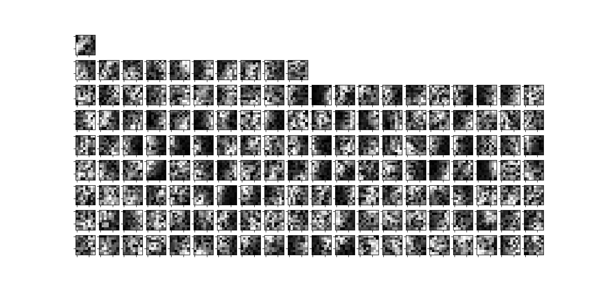

# admm_sparse_hierarchical
Non-negative Matrix Factorization with a tree norm regularization.

Inspired by:

- Proximal Methods for Hierarchical Sparse Coding - Jenatton, Miaral, et. al.
- Alternating Direction Multiplier Method - Boyd, et. al.
- Multplicative Rules for Non-negative Matrix Factorization.

  
 
 Splitting the problem to a joint minimization, with auxilary variables z and u such that x-z+u=0. We can find rules to update, I tried a plain old ADMM but this failed to converge for most patches. It was frustrating to say the least.
